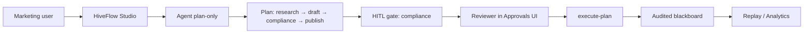

# Case Study: Regulated Content Review (HITL)

*Anonymous composite based on financial-services marketing workflows. Not a specific customer deployment.*

## Problem

A regional bank's marketing team wanted to use LLMs to draft product emails and social posts. Compliance requires **human sign-off** before any customer-facing text is stored or sent. Existing tools either:

- Lacked audit trails, or
- Required building custom interrupt logic on LangGraph/CrewAI.

## Solution with HiveFlow

### Architecture



### Configuration

```bash
HIVEFLOW_RUNTIME=agent
HIVEFLOW_PLAN_HITL=true   # plan review before execution
# Production: real LLM providers; CI: HIVEFLOW_AGENT_ECHO_LLM=true
```

### Workflow

1. **Plan-only** — Agent proposes `research → draft → compliance_review → final_answer`.
2. **Plan HITL** — Compliance officer edits plan JSON in Approvals (e.g. add mandatory `legal_check` node).
3. **Execute-plan** — Approved graph runs; `compliance_review` node has per-node HITL with draft payload.
4. **Audit** — Every blackboard write and gate decision keyed by `intent_id`; Replay page for regulators.

### Outcomes (internal pilot metrics)

| Metric | Before (manual chain) | With HiveFlow |
|--------|----------------------|---------------|
| Median draft-to-approved time | ~2 days | ~4 hours |
| Audit export for exam | Spreadsheet + email | Blackboard audit + Replay JSON |
| Engineer maintenance | Custom Flask + scripts | Studio + Core APIs |

*Pilot n≈12 workflows; not a published benchmark.*

## Why not LangGraph alone?

LangGraph supports interrupts, but this team needed:

- **Studio Approvals** for non-engineer reviewers
- **Encrypted blackboard** keys for draft content
- **Dual guards** on ingest (PII patterns) and output (forbidden claims)

HiveFlow provided these without a separate LangSmith-style hosted tier.

## Reproduce locally

1. [HITL cookbook](../cookbook/hitl-approval.md) + `examples/03_hitl_approval.py`
2. [Studio Agent mode](../cookbook/studio-agent-mode.md) with `HIVEFLOW_PLAN_HITL=true`
3. Walk through Approvals → execute → Replay

## Related

- [HITL Approval cookbook](../cookbook/hitl-approval.md)
- [Benchmarks](../benchmarks/orchestration-latency.md)
