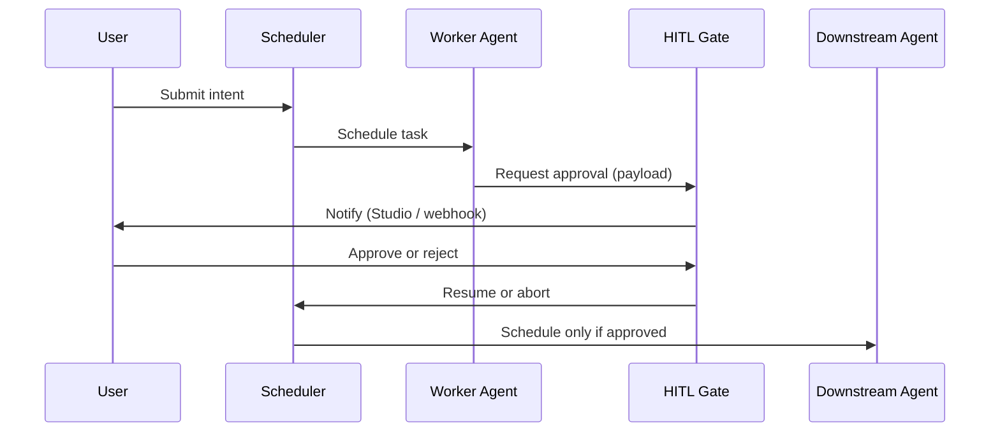

# Regulated HITL Approval Flow

End-to-end pattern: sensitive agent output requires human approval before downstream agents consume it.

## When to use

- Financial / legal / medical workflows
- Any action that mutates external systems after LLM reasoning

## Flow



## Minimal code

See [examples/03_hitl_approval.py](https://github.com/hiveflow/hiveflow/blob/main/examples/03_hitl_approval.py):

```python
from hiveflow import HiveFlow, HiveFlowConfig, ECM, HITLManager

hf = HiveFlow(HiveFlowConfig())
await hf.start()
hitl = HITLManager(hf.blackboard)

# Register agents, then gate sensitive writes through hitl.request_approval(...)
```

## Studio

1. Build workflow with a **HITL** node in Orchestrator
2. Approve from **Dashboard** or webhook callback
3. Audit trail is on `SecureBlackboard` — see [Concepts — Blackboard](../concepts.md#3-blackboard)

## Related

- [API Reference — HITL](../api-reference.md)
- [example 03](https://github.com/hiveflow/hiveflow/blob/main/examples/03_hitl_approval.py)
