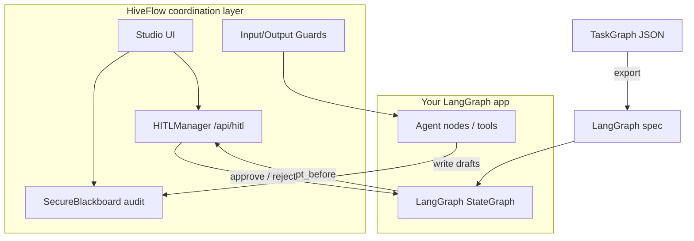

# LangGraph + HiveFlow Sidecar

Run **LangGraph** (or any graph runtime) for node execution while HiveFlow provides the **multi-agent coordination layer**: HITL gates, audited blackboard, guards, and Studio operations UI.

> **Status:** Sidecar pattern is **supported today** (export + Studio HITL APIs). In-process LangGraph execution via `LangGraphExecutionBackend.execute()` is a **v0.3 stub** — use export + external runtime for now.

## When to use

- Your team already standardized on **LangGraph** for graph execution
- You need **non-engineer reviewers** (Studio Approvals), **audit/replay**, or **encrypted blackboard** without rebuilding interrupts in LangGraph
- You want one **TaskGraph** format for Studio canvas, Agent `plan-only`, and LangGraph codegen

## Architecture



**HiveFlow does not replace LangGraph** in this pattern — it sits beside it as the **coordination & HITL layer** for multi-agent problems.

---

## Step 1 — Plan in HiveFlow (optional)

Use Agent `plan-only` or Studio Orchestrator Agent drawer:

```bash
curl -X POST http://localhost:8000/api/agent/plan-only \
  -H "Content-Type: application/json" \
  -d '{"query": "Research AI regulation, draft summary, compliance review"}'
```

You receive a TaskGraph:

```json
{
  "research": {"task": "search", "depends_on": []},
  "draft": {"task": "write", "depends_on": ["research"]},
  "compliance": {
    "task": "review",
    "depends_on": ["draft"],
    "hitl": {"action": "approval", "prompt": "Approve before publish?"}
  },
  "final_answer": {"task": "summarize", "depends_on": ["compliance"]}
}
```

---

## Step 2 — Export to LangGraph spec

### Python (Core)

```python
from hiveflow.execution import LangGraphExecutionBackend

backend = LangGraphExecutionBackend()
spec = backend.to_langgraph_spec(plan, workflow_id="content_pipeline")
# spec["interrupt_before"] includes HITL nodes (e.g. "compliance")
```

Or use the adapter directly:

```python
from hiveflow.adapters.langgraph import taskgraph_to_langgraph, render_langgraph_python

spec = taskgraph_to_langgraph(plan)
python_stub = render_langgraph_python(spec, graph_name="content_graph")
```

### Studio API

```bash
curl -X POST http://localhost:8000/api/agent/export-langgraph \
  -H "Content-Type: application/json" \
  -d '{"plan": {...}, "workflow_id": "content_pipeline", "include_python": true}'
```

Toolbar **Export LangGraph** on Orchestrator exports the canvas without a plan-only step.

---

## Step 3 — Run LangGraph externally

Implement your LangGraph graph as usual (`pip install langgraph langchain-core`). Map each HiveFlow skill name (`search`, `write`, …) to a LangGraph node function.

When LangGraph hits `interrupt_before` (from exported spec), **pause** and call HiveFlow instead of a custom Flask approval UI.

---

## Step 4 — Wire HITL through HiveFlow (sidecar)

### Create a gate (library)

From your LangGraph interrupt handler or a thin FastAPI sidecar:

```python
from hiveflow import HITLManager, HITLAction, SecureBlackboard

bb = SecureBlackboard()
hitl = HITLManager(bb)

gate = await hitl.create_gate(
    workflow_id="content_pipeline",
    node_id="compliance",
    action=HITLAction.APPROVAL,
    prompt="Approve draft before publish?",
    context={"draft": draft_text, "intent_id": trace_id},
    timeout_seconds=3600,
)
# Notify reviewer — gate.gate_id
```

### Respond via Studio API

Reviewers use **Studio → Approvals**, or automation calls:

```bash
# List pending
curl http://localhost:8000/api/hitl/pending

# Approve
curl -X POST http://localhost:8000/api/hitl/{gate_id}/respond \
  -H "Content-Type: application/json" \
  -d '{"approved": true, "comment": "LGTM"}'
```

Resume LangGraph only after `gate.status` is approved.

### Audit & replay

- Write agent outputs to `SecureBlackboard` with keys scoped by `intent_id`
- Use Studio **Replay** / **Tracer** with the same `intent_id` / `trace_id`
- See [Regulated HITL case study](../case-studies/regulated-hitl-content-review.md)

---

## Step 5 — Choose execution backend in code

HiveFlow exposes a pluggable backend (v0.2+):

```python
from hiveflow import SecureBlackboard
from hiveflow.execution import get_execution_backend, LangGraphExecutionBackend
from hiveflow.orchestrator import DynamicOrchestrator

bb = SecureBlackboard()
native = get_execution_backend("native", orchestrator=DynamicOrchestrator(bb))

# Full HiveFlow runtime (no LangGraph)
result = await native.execute(executable_graph, global_timeout=120.0)

# LangGraph: export only today
lg = LangGraphExecutionBackend()
spec = lg.to_langgraph_spec(skill_plan)
# await lg.execute(...)  → ExecutionBackendNotReadyError until v0.3 bridge
```

| Backend | `execute()` | Sidecar export |
|---------|-------------|----------------|
| `native` | ✅ DynamicOrchestrator | N/A |
| `langgraph` | ❌ stub (v0.3) | ✅ `to_langgraph_spec()` |

---

## ExecutionBackend reference

```python
class ExecutionBackend(ABC):
    async def execute(
        self,
        graph: TaskGraph,
        *,
        global_timeout: float | None = None,
        context: dict[str, Any] | None = None,
    ) -> GraphExecutionResult: ...
```

- **`GraphExecutionResult`**: `backend`, `results`, `status`, `metadata`
- **`NativeExecutionBackend`**: production default
- **`LangGraphExecutionBackend`**: export + future in-process bridge

Tests: `packages/core/tests/test_execution_backend.py`

---

## Limitations (0.1.x)

| Feature | Sidecar today | In-process LangGraph |
|---------|---------------|----------------------|
| Topology / depends_on | ✅ export | Planned v0.3 |
| HITL → interrupt_before hint | ✅ | Planned |
| Conditional edges | ❌ | ❌ |
| Checkpoint metadata round-trip | ❌ | ❌ |
| LangChain Tool bridge | Use MCP | Planned |

---

## Related

- [LangGraph integration (PoC)](../integrations/langgraph.md)
- [Migrate from LangGraph](../guides/migrate-from-langgraph.md)
- [HITL approval cookbook](hitl-approval.md)
- [Example: LangGraph export](https://github.com/hiveflow/hiveflow/blob/main/examples/16_langgraph_export.py)
