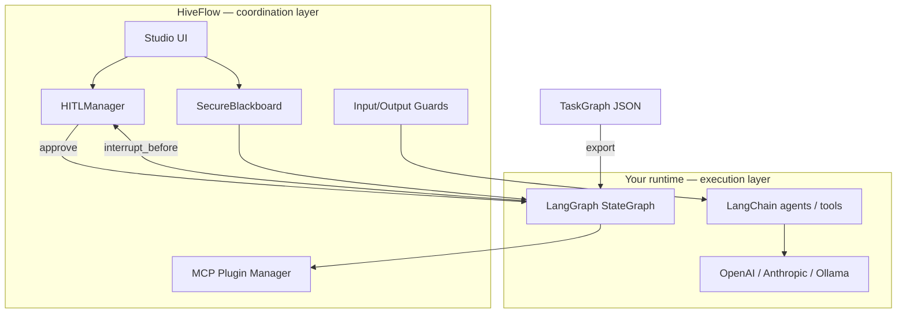
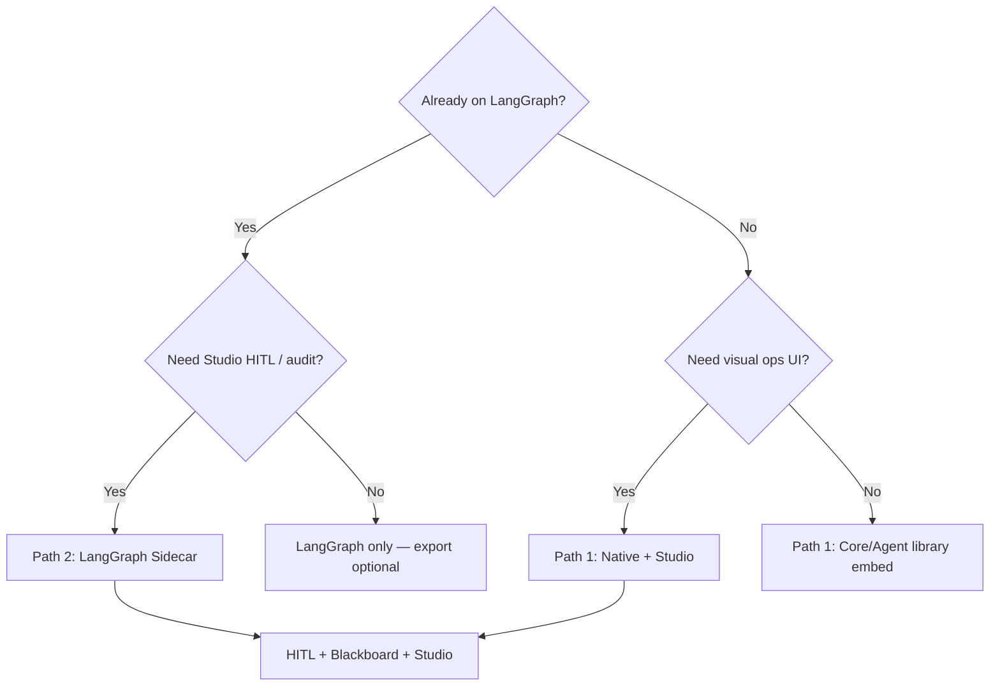

# Ecosystem Compatibility Guide

**LangChain · LangGraph · MCP · OpenAI / Anthropic**

This guide explains how HiveFlow interoperates with mainstream AI agent frameworks — and where HiveFlow adds value that those stacks typically require custom code for.

> **Positioning:** HiveFlow is a **multi-agent coordination & HITL layer**, not a drop-in replacement for LangChain. The recommended pattern is **Sidecar**: LangGraph (or your runtime) executes graphs; HiveFlow provides approval gates, audited shared state, guards, and Studio ops UI.

---

## Why HiveFlow alongside LangChain?

LangGraph, CrewAI, and AutoGen excel at **graph execution** and **agent loops**. Teams still rebuild the same cross-cutting concerns:

| Concern | Typical LangGraph/CrewAI approach | HiveFlow |
|---------|-----------------------------------|----------|
| Human approval before side effects | Custom `interrupt()` + bespoke UI | Native `HITLManager` + Studio **Approvals** |
| Shared state between agents | Graph state dict | `SecureBlackboard` (memory / Redis / **encrypted**) |
| Audit & compliance replay | LangSmith (paid) or DIY logging | Studio **Replay** + **Audit Log** + checkpoints |
| Prompt injection / output validation | DIY middleware | Built-in **Guards** |
| Tool protocol | LangChain Tools | **MCP-first** plugin marketplace |
| Visual ops for non-engineers | LangGraph Studio (paid) or none | Self-hosted **Studio** (Orchestrator, Tracer, Analytics) |
| One plan format for NL → canvas → export | Multiple formats | TaskGraph JSON → Studio canvas → LangGraph spec |

HiveFlow is **inspired by** LangGraph, CrewAI, and AutoGen — it fills the **coordination & governance** gap while letting you keep your preferred execution engine.

---

## Compatibility matrix (v0.1.x Alpha)

| Ecosystem piece | Status | How |
|-----------------|--------|-----|
| **LangGraph** topology export/import | ✅ PoC | `hiveflow.adapters.langgraph` |
| **LangGraph** in-process `execute()` | ❌ stub (v0.3) | Use Sidecar export |
| **LangChain Tools / Chains** | ⚠️ manual wrap | Register as `ReActTool` or MCP plugin |
| **LangChain LLM wrappers** | ⚠️ not required | HiveFlow native `LLMClient` (OpenAI, Anthropic, Ollama, DeepSeek) |
| **OpenAI / Anthropic APIs** | ✅ native | `packages/agent/llm/` + Core `llm_client.py` |
| **MCP tools** | ✅ first-class | `MCPPluginManager`, Studio Capability Market |
| **CrewAI / AutoGen / LlamaIndex** | ❌ no official adapter | Sidecar or custom `ExecutionBackend` |
| **LangSmith traces** | ⚠️ partial substitute | Studio Tracer / Replay; OpenTelemetry optional |

See [LangGraph integration](../integrations/langgraph.md) and [roadmap](../roadmap.md) (v0.3 adapter hardening).

---

## Architecture: coordination vs execution



**HiveFlow owns:** planning surface (NL → TaskGraph), human gates, encrypted blackboard, audit trail, ops UI.

**Your runtime owns:** node functions, LangChain chains, tool implementations, checkpointers (until v0.3 bridge).

---

## Path 1 — Native HiveFlow (full stack)

Use when you want **one stack** with HITL, blackboard, and Studio without LangGraph.

### Quick start

```bash
docker compose up --build
# Studio: http://localhost:3000
# API:    http://localhost:8000
```

Or library-only:

```bash
pip install -e packages/core -e packages/agent
python examples/01_hello_hiveflow.py
python examples/03_hitl_approval.py   # HITL
python examples/10_secure_blackboard.py  # encrypted blackboard
```

### HiveFlow-only differentiators in code

**1. HITL gate (no custom interrupt UI)**

```python
from hiveflow import HITLManager, HITLAction

gate = await hitl.create_gate(
    workflow_id="publish-pipeline",
    node_id="compliance_review",
    action=HITLAction.APPROVAL,
    prompt="Approve before publish?",
    context={"draft": draft_text},
    timeout_seconds=3600,
)
await hitl.respond(gate.gate_id, approved=True, comment="LGTM")
```

**2. Encrypted, audited blackboard**

```python
from hiveflow import HiveFlowConfig, EnvKeyProvider

config = HiveFlowConfig(
    blackboard_type="encrypted",
    encryption_key_provider=EnvKeyProvider("HIVEFLOW_ENCRYPTION_KEY"),
)
```

**3. MCP-native tools (not LangChain Tool classes)**

```python
from hiveflow import MCPPluginManager, PluginMarketplace

marketplace = PluginMarketplace()
manager = MCPPluginManager()
await marketplace.install_plugin("filesystem", manager)
```

**4. Studio Agent mode — NL → plan → canvas → execute**

```bash
curl -X POST http://localhost:8000/api/agent/plan-only \
  -H "Content-Type: application/json" \
  -d '{"query": "Research AI agents, write summary, compliance review"}'
```

With `HIVEFLOW_PLAN_HITL=true`, reviewers approve the plan in **Approvals** before **Execute DAG**.

→ [Studio Agent cookbook](../cookbook/studio-agent-mode.md) · [Complete Tutorial Part 5](../tutorial/part-5-studio.md)

---

## Path 2 — LangGraph Sidecar (recommended for LangGraph teams)

Keep LangGraph for execution; add HiveFlow for **HITL + audit + Studio**.

### Step 1 — Plan in HiveFlow

**Studio:** Orchestrator → Agent mode → **Plan only**

**API:**

```bash
curl -X POST http://localhost:8000/api/agent/plan-only \
  -H "Content-Type: application/json" \
  -d '{"query": "Research regulation, draft summary, compliance review"}'
```

Example TaskGraph:

```json
{
  "research": {"task": "search", "depends_on": []},
  "draft": {"task": "write", "depends_on": ["research"]},
  "compliance": {
    "task": "review",
    "depends_on": ["draft"],
    "hitl": {"action": "approval", "prompt": "Approve before publish?"}
  },
  "final_answer": {"task": "summarize", "depends_on": ["compliance"]}
}
```

### Step 2 — Export to LangGraph spec

**Python:**

```python
from hiveflow.adapters.langgraph import (
    taskgraph_to_langgraph,
    render_langgraph_python,
    dumps_langgraph_spec,
)

spec = taskgraph_to_langgraph(plan, workflow_id="content_pipeline")
print(dumps_langgraph_spec(spec))
# spec["interrupt_before"] includes "compliance" (from hitl config)

python_stub = render_langgraph_python(spec, graph_name="content_graph")
Path("content_graph.py").write_text(python_stub)
```

**Or via execution backend:**

```python
from hiveflow.execution import LangGraphExecutionBackend

backend = LangGraphExecutionBackend()
spec = backend.to_langgraph_spec(plan, workflow_id="content_pipeline")
```

**Studio API:**

```bash
curl -X POST http://localhost:8000/api/agent/export-langgraph \
  -H "Content-Type: application/json" \
  -d '{"plan": {...}, "workflow_id": "content_pipeline", "include_python": true}'
```

Toolbar **Export LangGraph** exports the current Orchestrator canvas without plan-only.

Run the export example:

```bash
python examples/16_langgraph_export.py
```

### Step 3 — Implement LangGraph nodes

Install LangGraph in **your** app (not required inside HiveFlow Core):

```bash
pip install langgraph langchain-core
```

Map HiveFlow skill names (`search`, `write`, `review`) to LangGraph node functions. Use exported `interrupt_before` for human nodes:

```python
# Pseudocode — wire your real tools
graph = builder.compile(
    interrupt_before=spec["interrupt_before"],
    checkpointer=your_checkpointer,
)
```

### Step 4 — Wire HITL through HiveFlow (Sidecar)

When LangGraph pauses at `interrupt_before`, call HiveFlow instead of building a custom approval Flask app.

**Create gate from your interrupt handler:**

```python
from hiveflow import HITLManager, HITLAction, SecureBlackboard

bb = SecureBlackboard()
hitl = HITLManager(bb)

gate = await hitl.create_gate(
    workflow_id="content_pipeline",
    node_id="compliance",
    action=HITLAction.APPROVAL,
    prompt="Approve draft before publish?",
    context={"draft": draft_text, "intent_id": trace_id},
    timeout_seconds=3600,
)
# Notify reviewer — gate.gate_id; poll or webhook
```

**Reviewers use Studio → Approvals**, or REST:

```bash
curl http://localhost:8000/api/hitl/pending

curl -X POST http://localhost:8000/api/hitl/{gate_id}/respond \
  -H "Content-Type: application/json" \
  -d '{"approved": true, "comment": "LGTM"}'
```

Resume LangGraph only after approval.

**Audit:** write agent outputs to `SecureBlackboard` keyed by `intent_id`; use Studio **Replay** / **Tracer** with the same id.

→ Full walkthrough: [LangGraph Sidecar cookbook](../cookbook/langgraph-sidecar.md)

### Step 5 — Round-trip back to HiveFlow

Import LangGraph spec → HiveFlow plan → Studio canvas:

```python
from hiveflow.adapters.langgraph import langgraph_to_taskgraph

plan = langgraph_to_taskgraph(spec)
# POST /api/agent/execute-plan or import to Orchestrator canvas
```

---

## Path 3 — LangChain Tools without native bridge

LangChain Tool wrappers are **not** auto-imported (planned v0.3). Wrap manually:

### Option A — ReActTool (Agent layer)

```python
from hiveflow_agent.worker.tools import ReActTool  # conceptual pattern

async def my_langchain_tool_fn(**kwargs):
    # call your @tool function or StructuredTool
    ...

tool = ReActTool(
    name="my_tool",
    description="...",
    handler=my_langchain_tool_fn,
    parameters={...},  # JSON Schema
)
# Register on ReActWorker
```

### Option B — MCP plugin (preferred in HiveFlow)

Expose tools via MCP so **any** MCP client (including future LangChain MCP adapters) can discover them:

1. Implement tool handlers under `packages/agent/worker/tools/` or a custom plugin.
2. Register with `MCPPluginManager`.
3. Install from Studio **Capability Market**.

HiveFlow standardizes on [MCP](https://github.com/modelcontextprotocol) — the same direction LangChain ecosystem is moving toward.

---

## LLM provider compatibility

HiveFlow does **not** require LangChain LLM classes. Native clients cover the same providers:

| Provider | Package | Env vars |
|----------|---------|----------|
| OpenAI | `packages/agent/llm/openai_client.py` | `OPENAI_API_KEY`, `LLM_MODEL` |
| Anthropic | `packages/agent/llm/anthropic_client.py` | `ANTHROPIC_API_KEY` |
| Ollama | `packages/agent/llm/ollama_client.py` | `OLLAMA_BASE_URL` |
| DeepSeek | `packages/agent/llm/deepseek_client.py` | `DEEPSEEK_API_KEY` |

Split planning vs execution:

```bash
HIVEFLOW_LLM_PLANNING_PROVIDER=openai
HIVEFLOW_LLM_EXECUTION_PROVIDER=anthropic
```

Echo mode for CI / no API key:

```bash
HIVEFLOW_AGENT_ECHO_LLM=true
```

Core abstraction (`hiveflow.llm_client.LLMClient`) keeps IntentParser, ReActWorker, and CognitiveOrchestrator backend-agnostic.

→ [OpenAI integration](../integrations/openai.md) · [Anthropic integration](../integrations/anthropic.md)

---

## Concept mapping reference

| LangGraph / LangChain | HiveFlow | HiveFlow advantage |
|-----------------------|----------|-------------------|
| `StateGraph` | `DAGOrchestrator` / `CognitiveOrchestrator` | NL plan-only + Studio canvas |
| Graph nodes | Agents + `task_handler` | Skill-based scheduler (3 strategies) |
| Shared state | `SecureBlackboard` | Encryption + audit keys |
| `interrupt()` | `HITLManager` | Studio Approvals + timeout policies |
| Checkpointer | `CheckpointManager` | Time travel + Studio Replay |
| LangChain Tools | MCP + `ReActWorker` | Unified marketplace, not class-per-tool |
| LangSmith | Studio Tracer / Analytics | Self-hosted, no per-seat SaaS |
| `create_react_agent` | `HiveMindApp.run_query` | Plan HITL + export to LangGraph |

→ [Migrate from LangGraph](../guides/migrate-from-langgraph.md)

---

## Execution backends

HiveFlow v0.2+ exposes pluggable backends:

```python
from hiveflow.execution import get_execution_backend, LangGraphExecutionBackend
from hiveflow.orchestrator import DynamicOrchestrator
from hiveflow import SecureBlackboard

bb = SecureBlackboard()
native = get_execution_backend("native", orchestrator=DynamicOrchestrator(bb))
result = await native.execute(executable_graph, global_timeout=120.0)

lg = LangGraphExecutionBackend()
spec = lg.to_langgraph_spec(skill_plan)
# await lg.execute(...) → stub until v0.3; use Sidecar today
```

| Backend | `execute()` | Export to LangGraph |
|---------|-------------|---------------------|
| `native` | ✅ production | N/A |
| `langgraph` | ❌ stub (v0.3) | ✅ `to_langgraph_spec()` |

---

## Decision tree: which path?



---

## Sidecar vs full replacement

| Question | Sidecar | Full HiveFlow |
|----------|---------|---------------|
| Keep existing LangGraph code? | ✅ | Reimplement nodes as Agents |
| Studio for reviewers? | ✅ | ✅ |
| MCP tool marketplace? | ✅ (coordination layer) | ✅ |
| Lowest migration cost? | ✅ | Medium |
| Single runtime dependency? | ❌ two systems | ✅ |

---

## Limitations (honest, 0.1.x)

| Feature | Sidecar today | In-process LangGraph |
|---------|---------------|----------------------|
| Topology / `depends_on` | ✅ export | Planned v0.3 |
| HITL → `interrupt_before` | ✅ | Planned |
| Conditional edges | ❌ | ❌ |
| Checkpoint metadata round-trip | ❌ | ❌ |
| LangChain Tool auto-bridge | ❌ manual wrap | Planned v0.3 |
| CrewAI / AutoGen adapters | ❌ | Community |

---

## Hands-on exercises

1. **Sidecar HITL:** Run `docker compose up`, plan-only a 3-node graph with `hitl` on the last node, export LangGraph JSON, verify `interrupt_before`.
2. **Native HITL:** Run `examples/03_hitl_approval.py` and compare with LangGraph interrupt docs.
3. **Blackboard audit:** Run `examples/10_secure_blackboard.py`, then open Studio **Blackboard** during a live workflow.
4. **Round-trip:** Export plan → `langgraph_to_taskgraph(spec)` → import to Orchestrator canvas → execute-plan.
5. **Provider swap:** Run Agent mode with `HIVEFLOW_AGENT_ECHO_LLM=true`, then switch to `OPENAI_API_KEY` without code changes.

---

## Related documentation

| Doc | Topic |
|-----|-------|
| [LangGraph Sidecar cookbook](../cookbook/langgraph-sidecar.md) | Step-by-step Sidecar |
| [LangGraph integration](../integrations/langgraph.md) | Adapter API & limits |
| [Migrate from LangGraph](../guides/migrate-from-langgraph.md) | Concept map |
| [HITL approval](../cookbook/hitl-approval.md) | Gate patterns |
| [Tutorial Part 4 — Integrations](../tutorial/part-4-integrations.md) | Examples 15–16 |
| [Regulated HITL case study](../case-studies/regulated-hitl-content-review.md) | Compliance story |
| [Roadmap](../roadmap.md) | v0.3 LangChain/LangGraph adapter |

---

## Summary

- **Compatible:** LangGraph (export/Sidecar), OpenAI/Anthropic/Ollama/DeepSeek, MCP tools, same LLM APIs as LangChain.
- **Not drop-in:** LangChain Tools/Chains, CrewAI, AutoGen — wrap or wait for v0.3 bridge.
- **HiveFlow's value:** HITL, encrypted audited blackboard, guards, self-hosted Studio, MCP-first tools, one TaskGraph from NL to LangGraph export.

Use **Sidecar** if you already have LangGraph. Use **native HiveFlow** if you want coordination + UI in one self-hosted stack.
