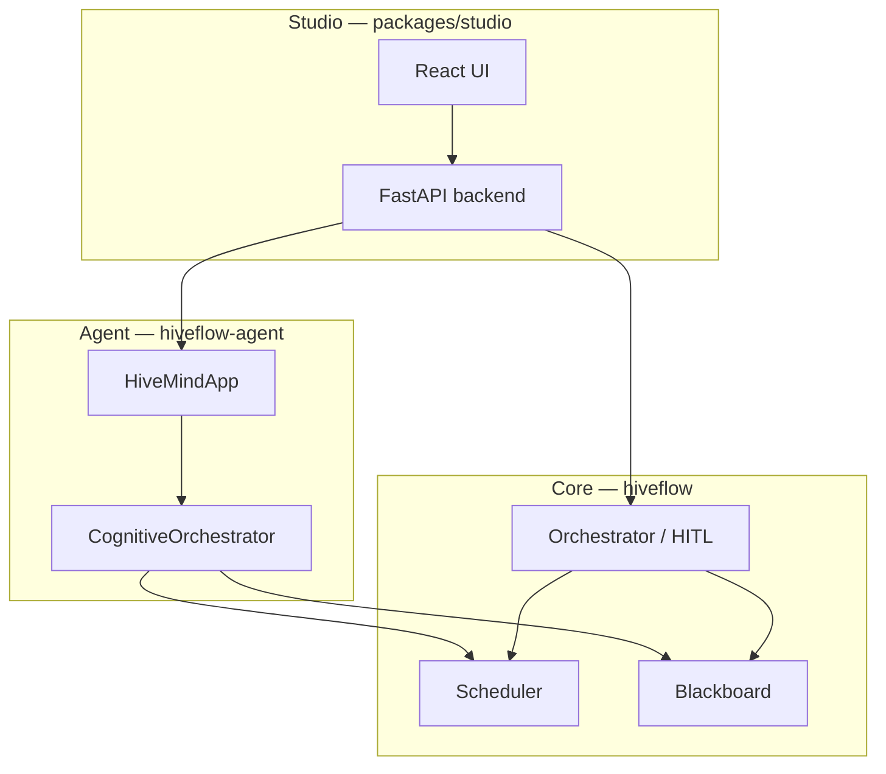

# HiveFlow Modules

HiveFlow ships as three cooperating packages in one repository. Each has its own README with install steps and API entry points.

## Overview

---

## Core — orchestration kernel

**PyPI:** `hiveflow` · **Path:** `packages/core`

Embeddable Python engine: event bus, skill-based scheduler, audited blackboard, static/dynamic DAG execution, HITL gates, checkpoints, guards, RAG, and MCP — with no UI or LLM requirement.

**Use when:** you integrate orchestration into your own service and control agents/ECM directly.

→ [Full Core README on GitHub](https://github.com/hiveflow/hiveflow/blob/main/packages/core/README.md) · [API](../api/index.md) · [Architecture](../architecture.md#layer-1-core-engine)

---

## Agent — cognitive runtime

**PyPI:** `hiveflow-agent` · **Path:** `packages/agent` · **Requires:** `hiveflow`

Adds `HiveMindApp`: natural language → TaskGraph plan → Skill-bound ReAct workers. Supports `run_query`, `plan_only`, and `execute_plan` (including plans imported from Studio or LangGraph).

**Use when:** users describe tasks in NL, or you want automatic planning/replanning on top of Core.

→ [Full Agent README on GitHub](https://github.com/hiveflow/hiveflow/blob/main/packages/agent/README.md) · [Studio Agent cookbook](../cookbook/studio-agent-mode.md)

---

## Studio — visual operations platform

**Path:** `packages/studio` · **Not on PyPI** · **Stack:** FastAPI + React

Self-hosted UI: Orchestrator, Chatflow, Approvals (HITL), Analytics, Tracer, Replay. Backend switches between Core DAG and Agent runtime (`HIVEFLOW_RUNTIME=agent`).

**Use when:** operators, reviewers, or demos need a browser-based control plane.

→ [Full Studio README on GitHub](https://github.com/hiveflow/hiveflow/blob/main/packages/studio/README.md) · [Agent ops](../studio-agent-ops.md)

---

## Which module do I need?

| Goal | Modules |
|------|---------|
| Python library in my app | Core only |
| NL agent with planning | Core + Agent |
| Team UI + HITL + analytics | Core + Agent + Studio (typical full stack) |
| Fixed DAG, no LLM | Core (+ Studio optional for canvas) |
