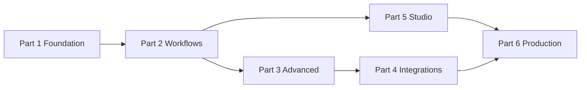

# Complete Tutorial

Welcome to the **full HiveFlow tutorial**. This series walks you from zero to production: Core engine, Agent runtime, Studio UI, security, scaling, and integrations.

## Who this is for

| Audience | Recommended path |
|----------|------------------|
| **New users** | Part 1 → Part 2 → Part 5 (Studio) |
| **Library embedders** | Part 1 → Part 2 → Part 3 |
| **Ops / platform** | Part 5 → Part 6 |
| **LangGraph users** | Part 4 + [LangGraph Sidecar](../cookbook/langgraph-sidecar.md) · [Ecosystem compatibility](../guides/ecosystem-compatibility.md) |

## Prerequisites

- Python **3.10+**
- `git` and `pip`
- **Optional:** Docker Desktop (Studio full stack)
- **Optional:** Redis (distributed blackboard)
- **Optional:** Node.js 18+ (Studio frontend dev)

## Learning path



| Part | Topics | Examples |
|------|--------|----------|
| [Part 1 — Foundation](part-1-foundation.md) | Install, repo layout, ECM, agents, blackboard | `01` |
| [Part 2 — Workflows](part-2-workflows.md) | Multi-agent, HITL, checkpoint, streaming, RAG, MCP | `02`–`07` |
| [Part 3 — Advanced](part-3-advanced.md) | Cognitive planning, evaluation, security, scale, plugins, guards | `08`–`14` |
| [Part 4 — Integrations](part-4-integrations.md) | Multimodal, LangGraph export | `15`–`16` |
| [Part 5 — Studio](part-5-studio.md) | Orchestrator, Chatflow, HITL UI, analytics, replay | Docker / local Studio |
| [Part 6 — Production](part-6-production.md) | Deploy, observability, troubleshooting, repo map | `deployment.md` |

## Quick start (5 minutes)

```bash
git clone https://github.com/jdidjhdh/hiveflow.git
cd hiveflow
docker compose up --build
```

Open **http://localhost:3000** → **Orchestrator** → enable **Agent / real mode** → enter a goal → **Plan only** → **Import to canvas** → **Execute DAG**.

Or without Docker:

```bash
pip install -e packages/core -e packages/agent
python examples/01_hello_hiveflow.py
```

## Runnable examples index

All 16 examples are smoke-tested in CI:

```bash
pip install -e "packages/core[all]"
python examples/run_smoke_tests.py
```

| # | File | Tutorial section |
|---|------|------------------|
| 01 | `01_hello_hiveflow.py` | [Part 1](part-1-foundation.md) |
| 02 | `02_multi_agent.py` | [Part 2](part-2-workflows.md) |
| 03 | `03_hitl_approval.py` | [Part 2](part-2-workflows.md) + [Cookbook HITL](../cookbook/hitl-approval.md) |
| 04 | `04_checkpoint.py` | [Part 2](part-2-workflows.md) + [Cookbook checkpoint](../cookbook/checkpoint-recovery.md) |
| 05 | `05_streaming.py` | [Part 2](part-2-workflows.md) |
| 06 | `06_rag_pipeline.py` | [Part 2](part-2-workflows.md) + [Cookbook RAG](../cookbook/rag-mcp-pipeline.md) |
| 07 | `07_mcp_tools.py` | [Part 2](part-2-workflows.md) |
| 08 | `08_cognitive_planning.py` | [Part 3](part-3-advanced.md) |
| 09 | `09_evaluation.py` | [Part 3](part-3-advanced.md) |
| 10 | `10_secure_blackboard.py` | [Part 3](part-3-advanced.md) |
| 11 | `11_distributed_agents.py` | [Part 3](part-3-advanced.md) |
| 12 | `12_custom_scheduler.py` | [Part 3](part-3-advanced.md) |
| 13 | `13_plugin_development.py` | [Part 3](part-3-advanced.md) |
| 14 | `14_guard_configuration.py` | [Part 3](part-3-advanced.md) |
| 15 | `15_multimodal_pipeline.py` | [Part 4](part-4-integrations.md) |
| 16 | `16_langgraph_export.py` | [Part 4](part-4-integrations.md) + [LangGraph Sidecar](../cookbook/langgraph-sidecar.md) |

## Related docs

- [Getting Started](../getting-started.md) — condensed quick start
- [Concepts](../concepts.md) — ECM, Cell, Scheduler terminology
- [Architecture](../architecture.md) — system design
- [Cookbook](../cookbook/index.md) — scenario deep-dives
- [API Reference](../api-reference.md) — HTTP and Python APIs
