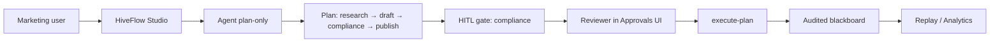

# 案例研究：受监管内容审阅（HITL）

*基于金融服务营销工作流的匿名合成案例。非特定客户部署。*

## 问题

某区域银行营销团队希望用 LLM 起草产品邮件与社媒帖子。合规要求在任何面向客户的文本存储或发送前，必须**人工签字批准**。现有工具要么：

- 缺少审计轨迹，或
- 需要在 LangGraph/CrewAI 上自建中断逻辑。

## HiveFlow 方案

### 架构



### 配置

```bash
HIVEFLOW_RUNTIME=agent
HIVEFLOW_PLAN_HITL=true   # plan review before execution
# Production: real LLM providers; CI: HIVEFLOW_AGENT_ECHO_LLM=true
```

### 工作流

1. **Plan-only** — Agent 提出 `research → draft → compliance_review → final_answer`。
2. **Plan HITL** — 合规官在 Approvals 中编辑计划 JSON（例如添加必填 `legal_check` 节点）。
3. **Execute-plan** — 已批准图执行；`compliance_review` 节点带 per-node HITL 与草稿载荷。
4. **Audit** — 每次黑板写入与 gate 决策按 `intent_id` 索引；监管人员使用 Replay 页面。

### 成果（内部试点指标）

| 指标 | 之前（手工链路） | 使用 HiveFlow |
|--------|----------------------|---------------|
| 草稿到批准中位时间 | ~2 天 | ~4 小时 |
| 检查用审计导出 | 电子表格 + 邮件 | Blackboard audit + Replay JSON |
| 工程师维护 | 自建 Flask + 脚本 | Studio + Core API |

*试点 n≈12 个工作流；非公开发布基准。*

## 为何不单用 LangGraph？

LangGraph 支持 interrupt，但该团队还需要：

- 供非工程师审阅者的 **Studio Approvals**
- 草稿内容的**加密黑板**键
- 入站（PII 模式）与出站（禁止声明）的**双重 guards**

HiveFlow 无需单独的 LangSmith 式托管层即可提供上述能力。

## 本地复现

1. [HITL 指南](../cookbook/hitl-approval.md) + `examples/03_hitl_approval.py`
2. [Studio Agent 模式](../cookbook/studio-agent-mode.md)，设置 `HIVEFLOW_PLAN_HITL=true`
3. 走通 Approvals → execute → Replay

## 相关

- [HITL 审批指南](../cookbook/hitl-approval.md)
- [基准测试](../benchmarks/orchestration-latency.md)
