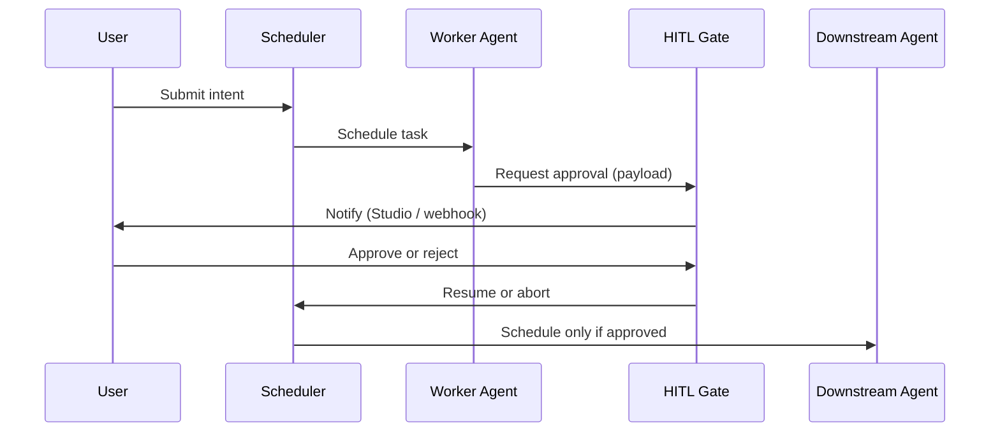

# 受监管 HITL 审批流程

端到端模式：敏感 Agent 输出在下游 Agent 消费前需人工审批。

## 适用场景

- 金融 / 法律 / 医疗工作流
- LLM 推理后变更外部系统的任何操作

## 流程



## 最小代码

参见 [examples/03_hitl_approval.py](https://github.com/jdidjhdh/hiveflow/blob/main/examples/03_hitl_approval.py)：

```python
from hiveflow import HiveFlow, HiveFlowConfig, ECM, HITLManager

hf = HiveFlow(HiveFlowConfig())
await hf.start()
hitl = HITLManager(hf.blackboard)

# Register agents, then gate sensitive writes through hitl.request_approval(...)
```

## Studio

1. 在 Orchestrator 中构建带 **HITL** 节点的工作流
2. 在 **Dashboard** 或通过 webhook 回调审批
3. 审计轨迹在 `SecureBlackboard` 上 — 见 [概念 — Blackboard](../concepts.md#3-blackboard)

## 相关

- [API 参考 — HITL](../api-reference.md)
- [示例 03](https://github.com/jdidjhdh/hiveflow/blob/main/examples/03_hitl_approval.py)
