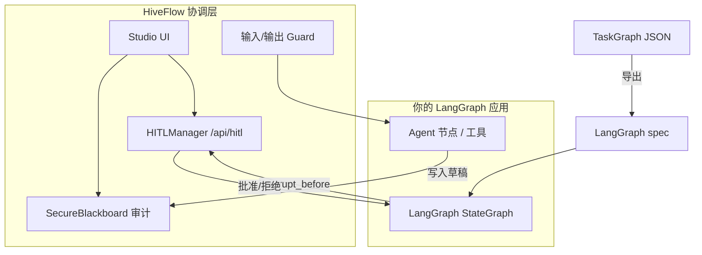

# LangGraph + HiveFlow Sidecar

在 **LangGraph**（或任意图运行时）中执行节点，由 HiveFlow 提供**多 Agent 协调层**：HITL 门控、可审计黑板、Guard 与 Studio 运维界面。

> **状态：** Sidecar 模式**现已支持**（导出 + Studio HITL API）。进程内 LangGraph 执行（`LangGraphExecutionBackend.execute()`）为 **v0.3 占位** — 当前请用导出 + 外部运行时。

## 适用场景

- 团队已标准化使用 **LangGraph** 跑图
- 需要**非工程师审批**（Studio Approvals）、**审计/回放**或**加密黑板**，而不想在 LangGraph 里重写 interrupt
- 希望 Studio 画布、Agent `plan-only` 与 LangGraph 代码生成共用同一 **TaskGraph** 格式

## 架构



**此模式下 HiveFlow 不替代 LangGraph** — 作为多 Agent 问题的**协调与 HITL 层**与之并存。

---

## 步骤 1 — 在 HiveFlow 中规划（可选）

使用 Agent `plan-only` 或 Studio Orchestrator Agent 抽屉：

```bash
curl -X POST http://localhost:8000/api/agent/plan-only \
  -H "Content-Type: application/json" \
  -d '{"query": "调研 AI 监管，撰写摘要，合规审核"}'
```

返回 TaskGraph（示例）：

```json
{
  "research": {"task": "search", "depends_on": []},
  "draft": {"task": "write", "depends_on": ["research"]},
  "compliance": {
    "task": "review",
    "depends_on": ["draft"],
    "hitl": {"action": "approval", "prompt": "发布前是否批准？"}
  },
  "final_answer": {"task": "summarize", "depends_on": ["compliance"]}
}
```

---

## 步骤 2 — 导出为 LangGraph 规格

### Python（Core）

```python
from hiveflow.execution import LangGraphExecutionBackend

backend = LangGraphExecutionBackend()
spec = backend.to_langgraph_spec(plan, workflow_id="content_pipeline")
# spec["interrupt_before"] 含 HITL 节点（如 "compliance"）
```

或直接使用适配器：

```python
from hiveflow.adapters.langgraph import taskgraph_to_langgraph, render_langgraph_python

spec = taskgraph_to_langgraph(plan)
python_stub = render_langgraph_python(spec, graph_name="content_graph")
```

### Studio API

```bash
curl -X POST http://localhost:8000/api/agent/export-langgraph \
  -H "Content-Type: application/json" \
  -d '{"plan": {...}, "workflow_id": "content_pipeline", "include_python": true}'
```

Orchestrator 工具栏 **导出 LangGraph** 可直接导出画布，无需 plan-only。

---

## 步骤 3 — 在外部运行 LangGraph

按常规方式实现 LangGraph 图（`pip install langgraph langchain-core`）。将 HiveFlow skill 名（`search`、`write` …）映射到 LangGraph 节点。

当 LangGraph 触发 `interrupt_before`（来自导出规格）时，**暂停**并调用 HiveFlow，而非自建 Flask 审批页。

---

## 步骤 4 — 经 HiveFlow 接入 HITL（Sidecar）

### 创建门控（库）

在 LangGraph interrupt 处理器或薄 FastAPI sidecar 中：

```python
from hiveflow import HITLManager, HITLAction, SecureBlackboard

bb = SecureBlackboard()
hitl = HITLManager(bb)

gate = await hitl.create_gate(
    workflow_id="content_pipeline",
    node_id="compliance",
    action=HITLAction.APPROVAL,
    prompt="发布前是否批准草稿？",
    context={"draft": draft_text, "intent_id": trace_id},
    timeout_seconds=3600,
)
```

### 经 Studio API 响应

审批人使用 **Studio → 审批**，或自动化调用：

```bash
curl http://localhost:8000/api/hitl/pending

curl -X POST http://localhost:8000/api/hitl/{gate_id}/respond \
  -H "Content-Type: application/json" \
  -d '{"approved": true, "comment": "同意"}'
```

仅在门控批准后恢复 LangGraph。

### 审计与回放

- 将 Agent 输出写入 `SecureBlackboard`，键按 `intent_id` 隔离
- Studio **Replay** / **Tracer** 使用相同 `intent_id` / `trace_id`
- 见 [合规 HITL 案例](../case-studies/regulated-hitl-content-review.md)

---

## 步骤 5 — 在代码中选择 ExecutionBackend

```python
from hiveflow import SecureBlackboard
from hiveflow.execution import get_execution_backend, LangGraphExecutionBackend
from hiveflow.orchestrator import DynamicOrchestrator

bb = SecureBlackboard()
native = get_execution_backend("native", orchestrator=DynamicOrchestrator(bb))

# 完整 HiveFlow 运行时（不用 LangGraph）
result = await native.execute(executable_graph, global_timeout=120.0)

# LangGraph：当前仅导出
lg = LangGraphExecutionBackend()
spec = lg.to_langgraph_spec(skill_plan)
# await lg.execute(...)  → ExecutionBackendNotReadyError，v0.3 桥接后可用
```

| 后端 | `execute()` | Sidecar 导出 |
|------|-------------|--------------|
| `native` | ✅ DynamicOrchestrator | — |
| `langgraph` | ❌ 占位（v0.3） | ✅ `to_langgraph_spec()` |

---

## ExecutionBackend 参考

- **`GraphExecutionResult`**：`backend`、`results`、`status`、`metadata`
- **`NativeExecutionBackend`**：生产默认
- **`LangGraphExecutionBackend`**：导出 + 未来进程内桥接

测试：`packages/core/tests/test_execution_backend.py`

---

## 限制（0.1.x）

| 能力 | Sidecar 现状 | 进程内 LangGraph |
|------|-------------|------------------|
| 拓扑 / depends_on | ✅ 导出 | v0.3 计划 |
| HITL → interrupt_before | ✅ | 计划中 |
| 条件边 | ❌ | ❌ |
| Checkpoint 元数据往返 | ❌ | ❌ |
| LangChain Tool 桥 | 用 MCP | 计划中 |

---

## 相关文档

- [LangGraph 集成（PoC）](../integrations/langgraph.md)
- [从 LangGraph 迁移](../guides/migrate-from-langgraph.md)
- [HITL 审批 cookbook](hitl-approval.md)
- [示例：LangGraph 导出](https://github.com/hiveflow/hiveflow/blob/main/examples/16_langgraph_export.py)
