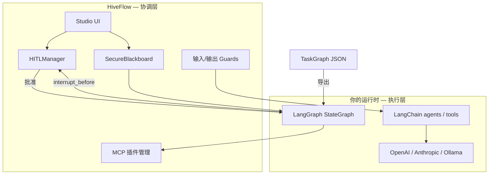
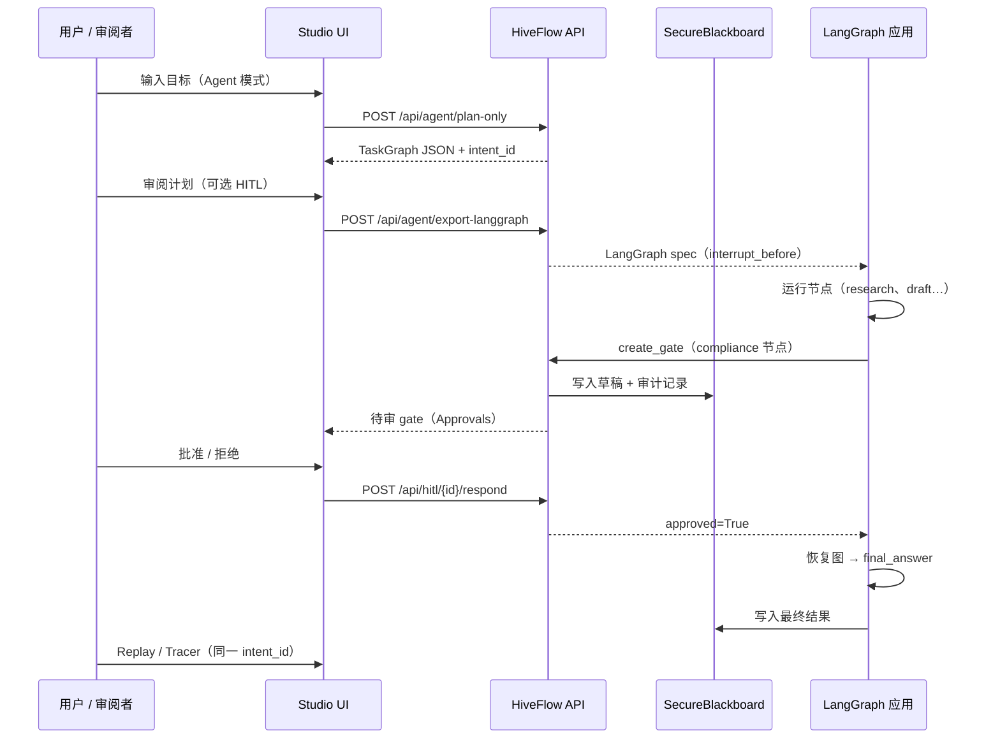
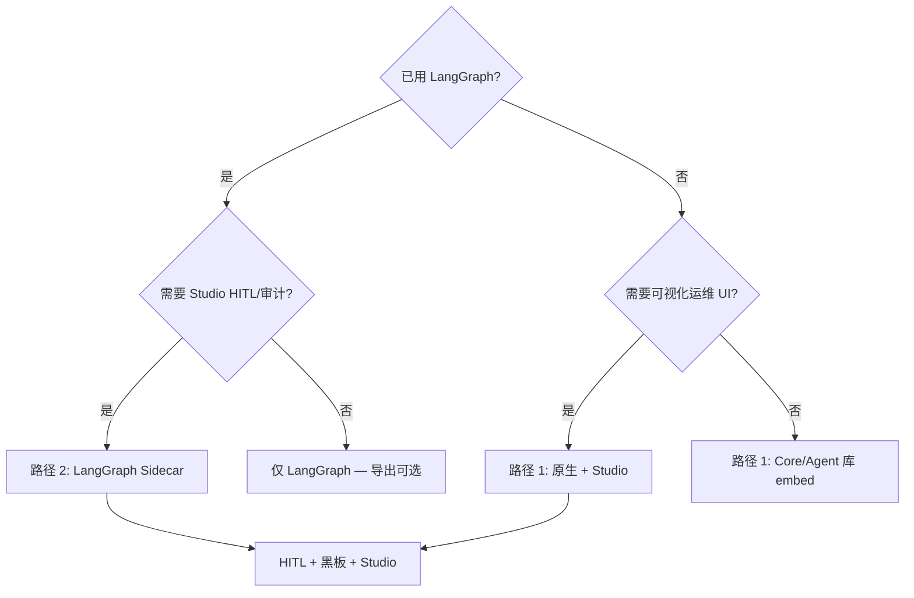

# 生态兼容指南

**LangChain · LangGraph · MCP · OpenAI / Anthropic**

本指南说明 HiveFlow 如何与主流 AI Agent 框架互操作，以及 HiveFlow 在哪些能力上提供 LangChain 生态通常需要自建的部分。

> **定位：** HiveFlow 是 **多 Agent 协调与 HITL 层**，不是 LangChain 的即插即用替代品。推荐模式为 **Sidecar（边车）**：LangGraph（或你的运行时）负责图执行；HiveFlow 提供审批门、可审计共享状态、护栏与 Studio 运维 UI。

---

## 为什么要在 LangChain 旁边用 HiveFlow？

LangGraph、CrewAI、AutoGen 擅长 **图执行** 与 **Agent 循环**。团队仍反复自建相同的横切能力：

| 关注点 | LangGraph/CrewAI 常见做法 | HiveFlow |
|--------|---------------------------|----------|
| 副作用前人工审批 | 自建 `interrupt()` + 审批 UI | 原生 `HITLManager` + Studio **Approvals** |
| Agent 间共享状态 | 图 state 字典 | `SecureBlackboard`（内存 / Redis / **加密**） |
| 审计与合规回放 | LangSmith（付费）或 DIY 日志 | Studio **Replay** + **Audit Log** + 检查点 |
| Prompt 注入 / 输出校验 | 自建中间件 | 内置 **Guards（护栏）** |
| 工具协议 | LangChain Tools | **MCP 优先** 的插件市场 |
| 非工程师的可视化运维 | LangGraph Studio（付费）或无 | 自托管 **Studio**（编排器、追踪、分析） |
| NL → 画布 → 导出统一格式 | 多种格式并存 | TaskGraph JSON → Studio 画布 → LangGraph spec |

HiveFlow **受** LangGraph、CrewAI、AutoGen **启发** — 填补 **协调与治理** 空白，同时保留你偏好的执行引擎。

---

## 兼容矩阵（v0.1.x Alpha）

| 生态组件 | 状态 | 方式 |
|----------|------|------|
| **LangGraph** 拓扑导出/导入 | ✅ PoC | `hiveflow.adapters.langgraph` |
| **LangGraph** 进程内 `execute()` | ❌ stub（v0.3） | 使用 Sidecar 导出 |
| **LangChain Tools / Chains** | ⚠️ 手动包装 | 注册为 `ReActTool` 或 MCP 插件 |
| **LangChain LLM 包装器** | ⚠️ 非必需 | HiveFlow 原生 `LLMClient`（OpenAI、Anthropic、Ollama、DeepSeek） |
| **OpenAI / Anthropic API** | ✅ 原生 | `packages/agent/llm/` + Core `llm_client.py` |
| **MCP 工具** | ✅ 一等公民 | `MCPPluginManager`、Studio 能力市场 |
| **CrewAI / AutoGen / LlamaIndex** | ❌ 无官方适配器 | Sidecar 或自定义 `ExecutionBackend` |
| **LangSmith 追踪** | ⚠️ 部分替代 | Studio Tracer / Replay；可选 OpenTelemetry |

详见 [LangGraph 集成](../integrations/langgraph.md) 与 [路线图](../roadmap.md)（v0.3 适配器强化）。

---

## 架构图与文字说明

本节为 **每一张架构图的每个框、每条箭头** 配备文字说明，可按图自上而下阅读，无需对照源码。

---

### 图 1 — 协调层 vs 执行层

<a id="figure-1-coordination-vs-execution"></a>

**本图说明什么：** HiveFlow 与 LangChain/LangGraph **并列协作**，而非嵌入其内部。上方为治理与运维；下方为图与 Agent 的实际运行位置。



#### 协调层 — 逐框说明

| # | 框 | 作用 | HiveFlow 特点 | LangGraph / LangChain 对应 |
|---|-----|------|---------------|---------------------------|
| 1 | **Studio UI** | Web 运维：编排画布、审批、黑板、追踪、回放、分析 | 自托管、无按席位 SaaS；非工程师可审批计划 | LangGraph Studio（付费）或自建管理页 |
| 2 | **HITLManager** | 创建审批门、跟踪待审/通过/拒绝、支持超时 | 原生 API + Studio **Approvals**；导出时映射 `interrupt_before` | `interrupt()` + 自建 UI |
| 3 | **SecureBlackboard** | Agent 间共享键值存储，带读写 ACL | 内存 / Redis / **AES 加密** + 审计日志 | 图内 `state` 字典 |
| 4 | **输入/输出 Guards** | 拦截 prompt 注入；校验输出大小/Schema | 工具执行前/后的内置纵深防御 | 在 Chain 上自建中间件 |
| 5 | **MCP 插件管理** | 发现、安装、调用 MCP 工具（文件、HTTP、代码执行等） | **MCP 优先** + Studio 能力市场 | LangChain `@tool` / `StructuredTool` |

#### 执行层 — 逐框说明

| # | 框 | 作用 | 由谁实现 |
|---|-----|------|----------|
| 6 | **LangGraph StateGraph** | 编译节点与边、运行 checkpointer、在 interrupt 处暂停 | Sidecar 下你的 LangGraph 应用；原生路径用 HiveFlow 编排器（无需 LangGraph） |
| 7 | **LangChain agents / tools** | ReAct 循环、Chain、Retriever、自定义 `@tool` | 你现有的 LangChain 代码 — 必要时包装为 MCP/ReActTool |
| 8 | **OpenAI / Anthropic / Ollama** | LLM 推理 | HiveFlow 原生客户端 **或** LangChain LLM 包装器 — API Key 相同 |

#### 箭头 — 数据流与控制流

| 箭头 | 含义 | 传递内容 / 触发条件 | 典型 API 或代码 |
|------|------|---------------------|-----------------|
| **Studio → HITLManager** | 审阅者在 **Approvals** 批准/拒绝 | `gate_id`、`approved`、`comment` | `POST /api/hitl/{id}/respond` |
| **Studio → SecureBlackboard** | 运维查看运行中共享键 | `intent_id`、黑板键 | `GET /api/blackboard/*` |
| **TaskGraph JSON → LangGraph** | 导出拓扑 + HITL 提示 | plan JSON → 含 `interrupt_before` 的 spec | `taskgraph_to_langgraph()` · `POST /api/agent/export-langgraph` |
| **LangGraph → HITLManager** | 图在人工节点暂停；Sidecar 创建 gate | `node_id`、草稿、`trace_id` | interrupt 处理器调用 `hitl.create_gate()` |
| **HITLManager → LangGraph** | 人工批准后图继续 | `approved=True` | 轮询 gate 或 webhook 后 `graph.invoke(...)` |
| **LangChain → LLM** | Agent 循环内调模型 | messages、tools | LangChain 或 HiveFlow `LLMClient` |
| **LangGraph → MCP** | 节点调用统一工具 | 工具名 + 参数 | `MCPPluginManager.invoke()` |
| **Guards → LangChain** | Chain 执行前后净化 I/O | 文本入/出 | `Guards.validate_input()` / `validate_output()` |
| **Blackboard → LangGraph** | 节点读写可审计共享状态 | 按 `intent_id` 的键值 | 节点内 `blackboard.sys_get/put()` |

**职责划分：**

- **HiveFlow 负责：** NL → TaskGraph 规划面、人工门、加密可审计黑板、护栏、自托管运维 UI、MCP 目录。
- **你的运行时负责：** 节点函数、LangChain 链、工具实现、LangGraph checkpointer（v0.3 进程内桥接前）。

→ 更完整的系统设计：[架构](../architecture.md)

---

### 图 2 — HiveFlow 原生三层栈

<a id="figure-2-three-layer-stack"></a>

**本图说明什么：** 运行 **全量 HiveFlow**（路径 1）时，组件纵向堆叠。这是 HiveFlow **内部**架构，与是否使用 LangGraph 无关。

```
┌─────────────────────────────────────────────────────────────┐
│  第 3 层 — HiveFlow Studio（React + FastAPI）               │
│  编排器 · Chatflow · 审批 · 追踪 · 分析                      │
└─────────────────────────────┬───────────────────────────────┘
                              │ REST + WebSocket（SSE）
┌─────────────────────────────▼───────────────────────────────┐
│  第 2 层 — HiveFlow Agent 运行时（hiveflow-agent）            │
│  NL 规划 · ReActWorker · LLM 路由 · 记忆 · 工具              │
└─────────────────────────────┬───────────────────────────────┘
                              │ ECM 消息 · 调度器调用
┌─────────────────────────────▼───────────────────────────────┐
│  第 1 层 — HiveFlow Core 引擎（hiveflow-core）              │
│  事件总线 · 调度器 · Cell · 黑板 · HITL · MCP               │
└─────────────────────────────────────────────────────────────┘
```

#### 分层说明

| 层 | 包 | 核心模块 | 在兼容故事中的角色 |
|----|-----|----------|-------------------|
| **第 3 层 — Studio** | `packages/studio` | Orchestrator、`/api/agent/*`、`/api/hitl/*` | 审阅者审批计划；UI 导出 LangGraph JSON |
| **第 2 层 — Agent** | `packages/agent` | `HiveMindApp`、`ReActWorker`、`llm/*` | NL → TaskGraph；不依赖 LangChain 亦可运行 |
| **第 1 层 — Core** | `packages/core` | `HiveFlow`、`HITLManager`、`adapters/langgraph` | 调度、黑板、HITL 原语、LangGraph 导出适配器 |

**与图 1 的关系：** 第 1–3 层共同构成 **HiveFlow 协调层方框**。Sidecar 模式下，第 2 层仍产出 TaskGraph JSON，但 **执行** 发生在外部 LangGraph 进程，而非 Core 原生编排器。

---

### 图 3 — Sidecar 生命周期（时序）

<a id="figure-3-sidecar-sequence"></a>

**本图说明什么：** 一次完整 Sidecar 流程 — 从自然语言计划到人工审批再到恢复执行。



#### 时序步骤说明

| 步骤 | 角色 | 动作 | HiveFlow 亮点 |
|------|------|------|---------------|
| 1 | 用户 | 在 Orchestrator Agent 抽屉输入目标 | 无需先写 LangGraph 代码即可 NL → TaskGraph |
| 2 | Studio | `plan-only` | 产出可审阅 JSON；可选 `HIVEFLOW_PLAN_HITL` 在执行前 gate |
| 3 | 用户 | 在画布审阅拓扑 | 可视化运维 — 纯 LangGraph CLI 不具备 |
| 4 | 导出 | `export-langgraph` | 单一格式连接 Studio ↔ LangGraph 团队 |
| 5 | LangGraph | 运行自动化节点 | 保留现有 LangGraph 投资 |
| 6 | LangGraph → HiveFlow | interrupt 处理器调用 `create_gate` | 替代自建审批微服务 |
| 7 | 黑板 | 存储草稿 + 审计 | 按 `intent_id` 加密键控，满足合规 |
| 8 | 审阅者 | Studio **Approvals** | 非工程师友好；与原生 HiveFlow HITL 同一 UX |
| 9 | 恢复 | `respond(approved=True)` 后 | LangGraph 继续；HiveFlow 记录决策 |
| 10 | 回放 | Tracer/Replay 同一 `intent_id` | 自托管审计轨迹，非仅 LangSmith |

---

### 图 4 — 决策树（选哪条集成路径？）

<a id="figure-4-decision-tree"></a>

**本图说明什么：** 如何在路径 1（原生）、路径 2（Sidecar）、仅 LangGraph 之间选择。



#### 决策节点说明

| 节点 | 问题 | 选 **是** | 选 **否** |
|------|------|-----------|-----------|
| **Q1** | 是否已标准化使用 LangGraph？ | 进入 Q2 — 考虑 Sidecar | 进入 Q3 — 原生 HiveFlow 更简单 |
| **Q2** | 是否需要 Studio HITL、审计或审阅 UI？ | **路径 2 Sidecar** — 保留 LangGraph 执行，加 HiveFlow 治理 | **仅 LangGraph** — 可选从 HiveFlow 做规划导出 |
| **Q3** | 是否需要可视化运维（编排器、追踪）？ | **路径 1 原生 + Studio** — `docker compose up` | **路径 1 库 embed** — 服务内嵌 Core/Agent，无 UI |
| **Sidecar / Native → HF** | 终点：获得 HiveFlow 协调能力 | HITL + 可审计黑板 + 自托管 Studio | — |

| 结果 | 最适合 | 你保留 | 从 HiveFlow 获得 |
|------|--------|--------|------------------|
| **路径 2 Sidecar** | 已有 LangGraph；需要合规/HITL | LangGraph 节点与 checkpointer | 审批 UI、黑板审计、护栏、MCP 市场 |
| **路径 1 原生 + Studio** | 新项目或接受全栈 | 单一依赖 | 一套自托管产品 |
| **路径 1 库 embed** | 后端微服务、无 UI | 最小 footprint | 进程内调度、HITL API、黑板 |
| **仅 LangGraph** | 无治理需求 | 现状 | 可选仅用 HiveFlow 做 TaskGraph 规划 |

---

## 路径 1 — 原生 HiveFlow（全栈）

适用于希望 **一套栈** 搞定 HITL、黑板与 Studio、无需 LangGraph 的场景。

### 快速开始

```bash
docker compose up --build
# Studio: http://localhost:3000
# API:    http://localhost:8000
```

或仅库模式：

```bash
pip install -e packages/core -e packages/agent
python examples/01_hello_hiveflow.py
python examples/03_hitl_approval.py      # HITL
python examples/10_secure_blackboard.py  # 加密黑板
```

### 原生 HiveFlow 差异化能力（代码）

**1. HITL 审批门（无需自建 interrupt UI）**

```python
from hiveflow import HITLManager, HITLAction

gate = await hitl.create_gate(
    workflow_id="publish-pipeline",
    node_id="compliance_review",
    action=HITLAction.APPROVAL,
    prompt="发布前是否批准？",
    context={"draft": draft_text},
    timeout_seconds=3600,
)
await hitl.respond(gate.gate_id, approved=True, comment="LGTM")
```

**2. 加密、可审计黑板**

```python
from hiveflow import HiveFlowConfig, EnvKeyProvider

config = HiveFlowConfig(
    blackboard_type="encrypted",
    encryption_key_provider=EnvKeyProvider("HIVEFLOW_ENCRYPTION_KEY"),
)
```

**3. MCP 原生工具（非 LangChain Tool 类）**

```python
from hiveflow import MCPPluginManager, PluginMarketplace

marketplace = PluginMarketplace()
manager = MCPPluginManager()
await marketplace.install_plugin("filesystem", manager)
```

**4. Studio Agent 模式 — NL → 计划 → 画布 → 执行**

```bash
curl -X POST http://localhost:8000/api/agent/plan-only \
  -H "Content-Type: application/json" \
  -d '{"query": "调研 AI Agent 趋势，写摘要，合规审阅"}'
```

启用 `HIVEFLOW_PLAN_HITL=true` 时，审阅者在 **Approvals** 批准计划后再 **执行 DAG**。

→ [Studio Agent Cookbook](../cookbook/studio-agent-mode.md) · [完整教程第 5 部分](../tutorial/part-5-studio.md)

---

## 路径 2 — LangGraph Sidecar（LangGraph 团队推荐）

保留 LangGraph 执行；用 HiveFlow 补 **HITL + 审计 + Studio**。

### 步骤 1 — 在 HiveFlow 中规划

**Studio：** Orchestrator → Agent 模式 → **Plan only（仅规划）**

**API：**

```bash
curl -X POST http://localhost:8000/api/agent/plan-only \
  -H "Content-Type: application/json" \
  -d '{"query": "调研法规，写摘要，合规审阅"}'
```

示例 TaskGraph：

```json
{
  "research": {"task": "search", "depends_on": []},
  "draft": {"task": "write", "depends_on": ["research"]},
  "compliance": {
    "task": "review",
    "depends_on": ["draft"],
    "hitl": {"action": "approval", "prompt": "发布前批准？"}
  },
  "final_answer": {"task": "summarize", "depends_on": ["compliance"]}
}
```

### 步骤 2 — 导出为 LangGraph spec

**Python：**

```python
from hiveflow.adapters.langgraph import (
    taskgraph_to_langgraph,
    render_langgraph_python,
    dumps_langgraph_spec,
)

spec = taskgraph_to_langgraph(plan, workflow_id="content_pipeline")
print(dumps_langgraph_spec(spec))
# spec["interrupt_before"] 含 "compliance"（来自 hitl 配置）

python_stub = render_langgraph_python(spec, graph_name="content_graph")
Path("content_graph.py").write_text(python_stub)
```

**或通过 execution backend：**

```python
from hiveflow.execution import LangGraphExecutionBackend

backend = LangGraphExecutionBackend()
spec = backend.to_langgraph_spec(plan, workflow_id="content_pipeline")
```

**Studio API：**

```bash
curl -X POST http://localhost:8000/api/agent/export-langgraph \
  -H "Content-Type: application/json" \
  -d '{"plan": {...}, "workflow_id": "content_pipeline", "include_python": true}'
```

工具栏 **导出 LangGraph** 可在无 plan-only 步骤时导出当前 Orchestrator 画布。

运行导出示例：

```bash
python examples/16_langgraph_export.py
```

### 步骤 3 — 实现 LangGraph 节点

在 **你的** 应用中安装 LangGraph（Core 内不强制依赖）：

```bash
pip install langgraph langchain-core
```

将 HiveFlow skill 名（`search`、`write`、`review`）映射到 LangGraph 节点函数。对人工节点使用导出的 `interrupt_before`：

```python
# 伪代码 — 接入真实工具
graph = builder.compile(
    interrupt_before=spec["interrupt_before"],
    checkpointer=your_checkpointer,
)
```

### 步骤 4 — 通过 HiveFlow 接线 HITL（Sidecar）

LangGraph 在 `interrupt_before` 暂停时，调用 HiveFlow，而非自建 Flask 审批页。

**在 interrupt 处理器中创建 gate：**

```python
from hiveflow import HITLManager, HITLAction, SecureBlackboard

bb = SecureBlackboard()
hitl = HITLManager(bb)

gate = await hitl.create_gate(
    workflow_id="content_pipeline",
    node_id="compliance",
    action=HITLAction.APPROVAL,
    prompt="发布前批准草稿？",
    context={"draft": draft_text, "intent_id": trace_id},
    timeout_seconds=3600,
)
# 通知审阅者 — gate.gate_id；轮询或 webhook
```

**审阅者使用 Studio → Approvals**，或 REST：

```bash
curl http://localhost:8000/api/hitl/pending

curl -X POST http://localhost:8000/api/hitl/{gate_id}/respond \
  -H "Content-Type: application/json" \
  -d '{"approved": true, "comment": "LGTM"}'
```

批准后再恢复 LangGraph。

**审计：** 将 Agent 输出写入按 `intent_id` 键控的 `SecureBlackboard`；用 Studio **Replay** / **Tracer** 查看同一 id。

→ 完整步骤：[LangGraph Sidecar Cookbook](../cookbook/langgraph-sidecar.md)

### 步骤 5 — 往返回 HiveFlow

LangGraph spec → HiveFlow plan → Studio 画布：

```python
from hiveflow.adapters.langgraph import langgraph_to_taskgraph

plan = langgraph_to_taskgraph(spec)
# POST /api/agent/execute-plan 或导入 Orchestrator 画布
```

---

## 路径 3 — 无原生桥接时使用 LangChain Tools

LangChain Tool 包装器 **不会** 自动导入（计划 v0.3）。需手动包装：

### 方案 A — ReActTool（Agent 层）

```python
# 概念模式 — 包装现有 @tool 或 StructuredTool
async def my_langchain_tool_fn(**kwargs):
    ...

tool = ReActTool(
    name="my_tool",
    description="...",
    handler=my_langchain_tool_fn,
    parameters={...},  # JSON Schema
)
# 注册到 ReActWorker
```

### 方案 B — MCP 插件（HiveFlow 推荐）

通过 MCP 暴露工具，便于 **任意** MCP 客户端（含未来 LangChain MCP 适配器）发现：

1. 在 `packages/agent/worker/tools/` 或自定义插件中实现 handler。
2. 用 `MCPPluginManager` 注册。
3. 在 Studio **Capability Market** 安装。

HiveFlow 标准化 [MCP](https://github.com/modelcontextprotocol) — 与 LangChain 生态整体方向一致。

---

## LLM Provider 兼容

HiveFlow **不依赖** LangChain LLM 类。原生客户端覆盖相同 Provider：

| Provider | 包路径 | 环境变量 |
|----------|--------|----------|
| OpenAI | `packages/agent/llm/openai_client.py` | `OPENAI_API_KEY`、`LLM_MODEL` |
| Anthropic | `packages/agent/llm/anthropic_client.py` | `ANTHROPIC_API_KEY` |
| Ollama | `packages/agent/llm/ollama_client.py` | `OLLAMA_BASE_URL` |
| DeepSeek | `packages/agent/llm/deepseek_client.py` | `DEEPSEEK_API_KEY` |

规划与执行分开路由：

```bash
HIVEFLOW_LLM_PLANNING_PROVIDER=openai
HIVEFLOW_LLM_EXECUTION_PROVIDER=anthropic
```

无 API Key 的 CI / 联调：

```bash
HIVEFLOW_AGENT_ECHO_LLM=true
```

Core 抽象（`hiveflow.llm_client.LLMClient`）使 IntentParser、ReActWorker、CognitiveOrchestrator 与后端解耦。

→ [OpenAI 集成](../integrations/openai.md) · [Anthropic 集成](../integrations/anthropic.md)

---

## 概念对照表

| LangGraph / LangChain | HiveFlow | HiveFlow 优势 |
|-----------------------|----------|---------------|
| `StateGraph` | `DAGOrchestrator` / `CognitiveOrchestrator` | NL plan-only + Studio 画布 |
| 图节点 | Agent + `task_handler` | 基于 Skill 的调度（3 种策略） |
| 共享状态 | `SecureBlackboard` | 加密 + 审计键 |
| `interrupt()` | `HITLManager` | Studio Approvals + 超时策略 |
| Checkpointer | `CheckpointManager` | 时间旅行 + Studio Replay |
| LangChain Tools | MCP + `ReActWorker` | 统一市场，非每工具一个类 |
| LangSmith | Studio Tracer / Analytics | 自托管，无按席位 SaaS |
| `create_react_agent` | `HiveMindApp.run_query` | 计划 HITL + 导出 LangGraph |

→ [从 LangGraph 迁移](../guides/migrate-from-langgraph.md)

---

## 执行后端

HiveFlow v0.2+ 提供可插拔后端：

```python
from hiveflow.execution import get_execution_backend, LangGraphExecutionBackend
from hiveflow.orchestrator import DynamicOrchestrator
from hiveflow import SecureBlackboard

bb = SecureBlackboard()
native = get_execution_backend("native", orchestrator=DynamicOrchestrator(bb))
result = await native.execute(executable_graph, global_timeout=120.0)

lg = LangGraphExecutionBackend()
spec = lg.to_langgraph_spec(skill_plan)
# await lg.execute(...) → v0.3 前为 stub；当前用 Sidecar
```

| 后端 | `execute()` | 导出 LangGraph |
|------|-------------|----------------|
| `native` | ✅ 生产可用 | 不适用 |
| `langgraph` | ❌ stub（v0.3） | ✅ `to_langgraph_spec()` |

---

## 决策树：选哪条路径？

见上文 [架构图与文字说明](#figure-4-decision-tree) 中的 **图 4** 及逐节点说明。

---

## Sidecar vs 全量替换

| 问题 | Sidecar | 全量 HiveFlow |
|------|---------|---------------|
| 保留现有 LangGraph 代码？ | ✅ | 需将节点重写为 Agent |
| Studio 给审阅者？ | ✅ | ✅ |
| MCP 工具市场？ | ✅（协调层） | ✅ |
| 迁移成本最低？ | ✅ | 中等 |
| 单一运行时依赖？ | ❌ 两套系统 | ✅ |

---

## 限制（如实说明，0.1.x）

| 能力 | Sidecar 现状 | 进程内 LangGraph |
|------|--------------|------------------|
| 拓扑 / `depends_on` | ✅ 导出 | 计划 v0.3 |
| HITL → `interrupt_before` | ✅ | 计划中 |
| 条件边 | ❌ | ❌ |
| 检查点元数据往返 | ❌ | ❌ |
| LangChain Tool 自动桥接 | ❌ 手动包装 | 计划 v0.3 |
| CrewAI / AutoGen 适配器 | ❌ | 社区 |

---

## 动手练习

1. **Sidecar HITL：** `docker compose up`，plan-only 一个 3 节点图并在末节点加 `hitl`，导出 LangGraph JSON，检查 `interrupt_before`。
2. **原生 HITL：** 运行 `examples/03_hitl_approval.py`，对比 LangGraph interrupt 文档。
3. **黑板审计：** 运行 `examples/10_secure_blackboard.py`，再在 live 工作流中打开 Studio **Blackboard**。
4. **往返：** 导出 plan → `langgraph_to_taskgraph(spec)` → 导入 Orchestrator 画布 → execute-plan。
5. **切换 Provider：** Agent 模式先用 `HIVEFLOW_AGENT_ECHO_LLM=true`，再换 `OPENAI_API_KEY`，无需改代码。

---

## 相关文档

| 文档 | 主题 |
|------|------|
| [LangGraph Sidecar Cookbook](../cookbook/langgraph-sidecar.md) | Sidecar 逐步指南 |
| [LangGraph 集成](../integrations/langgraph.md) | 适配器 API 与限制 |
| [从 LangGraph 迁移](../guides/migrate-from-langgraph.md) | 概念映射 |
| [HITL 审批](../cookbook/hitl-approval.md) | Gate 模式 |
| [教程第 4 部分 — 集成](../tutorial/part-4-integrations.md) | 示例 15–16 |
| [合规 HITL 案例](../case-studies/regulated-hitl-content-review.md) | 合规场景 |
| [路线图](../roadmap.md) | v0.3 LangChain/LangGraph 适配器 |

---

## 总结

- **兼容：** LangGraph（导出/Sidecar）、OpenAI/Anthropic/Ollama/DeepSeek、MCP 工具、与 LangChain 相同的 LLM API。
- **非即插即用：** LangChain Tools/Chains、CrewAI、AutoGen — 需包装或等待 v0.3 桥接。
- **HiveFlow 价值：** HITL、加密可审计黑板、护栏、自托管 Studio、MCP 优先工具、从 NL 到 LangGraph 导出的统一 TaskGraph。

已有 LangGraph 用 **Sidecar**；要协调层 + UI 一体选自托管 **原生 HiveFlow**。
