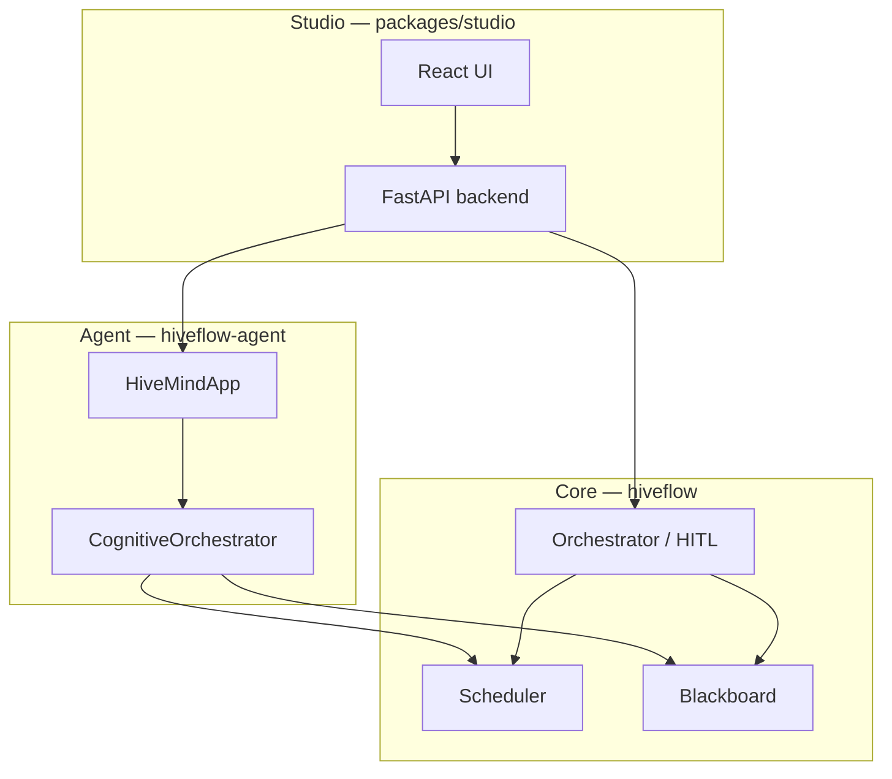

# HiveFlow 模块

HiveFlow 以同一仓库内三个协作包的形式交付。每个包都有独立的 README，含安装步骤与 API 入口。

## 概览

---

## Core — 编排内核

**PyPI：** `hiveflow` · **路径：** `packages/core`

可嵌入的 Python 引擎：事件总线、基于 Skill 的调度器、带审计的黑板、静态/动态 DAG 执行、HITL 门控、checkpoint、guards、RAG 与 MCP — 无需 UI 或 LLM。

**适用场景：** 将编排集成到自有服务，并直接控制 Agent/ECM。

→ [GitHub 完整 Core README](https://github.com/hiveflow/hiveflow/blob/main/packages/core/README.md) · [API](../api/index.md) · [架构](../architecture.md#layer-1-core-engine)

---

## Agent — 认知运行时

**PyPI：** `hiveflow-agent` · **路径：** `packages/agent` · **依赖：** `hiveflow`

新增 `HiveMindApp`：自然语言 → TaskGraph 计划 → 绑定 Skill 的 ReAct Worker。支持 `run_query`、`plan_only` 与 `execute_plan`（含从 Studio 或 LangGraph 导入的计划）。

**适用场景：** 用户以自然语言描述任务，或需要在 Core 之上自动规划/重规划。

→ [GitHub 完整 Agent README](https://github.com/hiveflow/hiveflow/blob/main/packages/agent/README.md) · [Studio Agent 指南](../cookbook/studio-agent-mode.md)

---

## Studio — 可视化运维平台

**路径：** `packages/studio` · **未上 PyPI** · **技术栈：** FastAPI + React

自托管 UI：Orchestrator、Chatflow、Approvals（HITL）、Analytics、Tracer、Replay。后端可在 Core DAG 与 Agent 运行时之间切换（`HIVEFLOW_RUNTIME=agent`）。

**适用场景：** 运维人员、审阅者或演示需要基于浏览器的控制平面。

→ [GitHub 完整 Studio README](https://github.com/hiveflow/hiveflow/blob/main/packages/studio/README.md) · [Agent 运维](../studio-agent-ops.md)

---

## 我需要哪个模块？

| 目标 | 模块 |
|------|---------|
| 应用中的 Python 库 | 仅 Core |
| 带规划的自然语言 Agent | Core + Agent |
| 团队 UI + HITL + 分析 | Core + Agent + Studio（典型全栈） |
| 固定 DAG、无 LLM | Core（Studio 可选，用于画布） |
