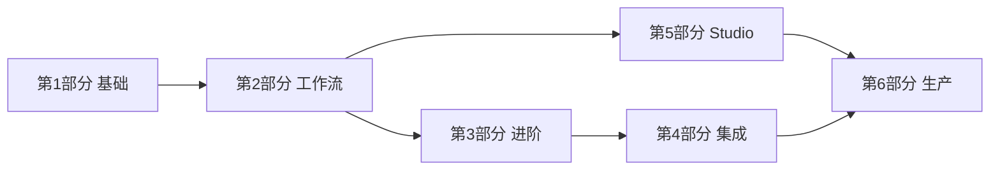

# 完整教程

欢迎阅读 **HiveFlow 完整教程**。本系列从零带你走到生产可用：Core 引擎、Agent 运行时、Studio UI、安全、扩展与集成。

## 适合谁

| 读者 | 推荐路径 |
|------|----------|
| **新用户** | 第 1 部分 → 第 2 部分 → 第 5 部分（Studio） |
| **库/embed 开发者** | 第 1 部分 → 第 2 部分 → 第 3 部分 |
| **运维 / 平台** | 第 5 部分 → 第 6 部分 |
| **LangGraph 用户** | 第 4 部分 + [LangGraph Sidecar](../cookbook/langgraph-sidecar.md) |

## 前置条件

- Python **3.10+**
- `git` 与 `pip`
- **可选：** Docker Desktop（Studio 全栈）
- **可选：** Redis（分布式黑板）
- **可选：** Node.js 18+（Studio 前端开发）

## 学习路径



| 部分 | 主题 | 对应示例 |
|------|------|----------|
| [第 1 部分 — 基础](part-1-foundation.md) | 安装、仓库结构、ECM、Agent、黑板 | `01` |
| [第 2 部分 — 工作流](part-2-workflows.md) | 多 Agent、HITL、检查点、流式、RAG、MCP | `02`–`07` |
| [第 3 部分 — 进阶](part-3-advanced.md) | 认知规划、评估、安全、扩展、插件、护栏 | `08`–`14` |
| [第 4 部分 — 集成](part-4-integrations.md) | 多模态、LangGraph 导出 | `15`–`16` |
| [第 5 部分 — Studio](part-5-studio.md) | 编排器、Chatflow、HITL UI、分析、回放 | Docker / 本地 Studio |
| [第 6 部分 — 生产](part-6-production.md) | 部署、可观测性、排障、仓库地图 | `deployment.md` |

## 5 分钟快速体验

```bash
git clone https://github.com/jdidjhdh/hiveflow.git
cd hiveflow
docker compose up --build
```

打开 **http://localhost:3000** → **Orchestrator（编排器）** → 开启 **Agent / real mode** → 输入目标 → **Plan only** → **导入到画布** → **执行 DAG**。

或不使用 Docker：

```bash
pip install -e packages/core -e packages/agent
python examples/01_hello_hiveflow.py
```

## 可运行示例索引

16 个示例均在 CI 中冒烟测试：

```bash
pip install -e "packages/core[all]"
python examples/run_smoke_tests.py
```

| # | 文件 | 教程章节 |
|---|------|----------|
| 01 | `01_hello_hiveflow.py` | [第 1 部分](part-1-foundation.md) |
| 02 | `02_multi_agent.py` | [第 2 部分](part-2-workflows.md) |
| 03 | `03_hitl_approval.py` | [第 2 部分](part-2-workflows.md) + [Cookbook HITL](../cookbook/hitl-approval.md) |
| 04 | `04_checkpoint.py` | [第 2 部分](part-2-workflows.md) + [Cookbook 检查点](../cookbook/checkpoint-recovery.md) |
| 05 | `05_streaming.py` | [第 2 部分](part-2-workflows.md) |
| 06 | `06_rag_pipeline.py` | [第 2 部分](part-2-workflows.md) + [Cookbook RAG](../cookbook/rag-mcp-pipeline.md) |
| 07 | `07_mcp_tools.py` | [第 2 部分](part-2-workflows.md) |
| 08 | `08_cognitive_planning.py` | [第 3 部分](part-3-advanced.md) |
| 09 | `09_evaluation.py` | [第 3 部分](part-3-advanced.md) |
| 10 | `10_secure_blackboard.py` | [第 3 部分](part-3-advanced.md) |
| 11 | `11_distributed_agents.py` | [第 3 部分](part-3-advanced.md) |
| 12 | `12_custom_scheduler.py` | [第 3 部分](part-3-advanced.md) |
| 13 | `13_plugin_development.py` | [第 3 部分](part-3-advanced.md) |
| 14 | `14_guard_configuration.py` | [第 3 部分](part-3-advanced.md) |
| 15 | `15_multimodal_pipeline.py` | [第 4 部分](part-4-integrations.md) |
| 16 | `16_langgraph_export.py` | [第 4 部分](part-4-integrations.md) + [LangGraph Sidecar](../cookbook/langgraph-sidecar.md) |

## 相关文档

- [快速入门](../getting-started.md) — 精简版上手
- [核心概念](../concepts.md) — ECM、Cell、Scheduler 术语
- [架构](../architecture.md) — 系统设计
- [实践指南](../cookbook/index.md) — 场景深度指南
- [API 参考](../api-reference.md) — HTTP 与 Python API
